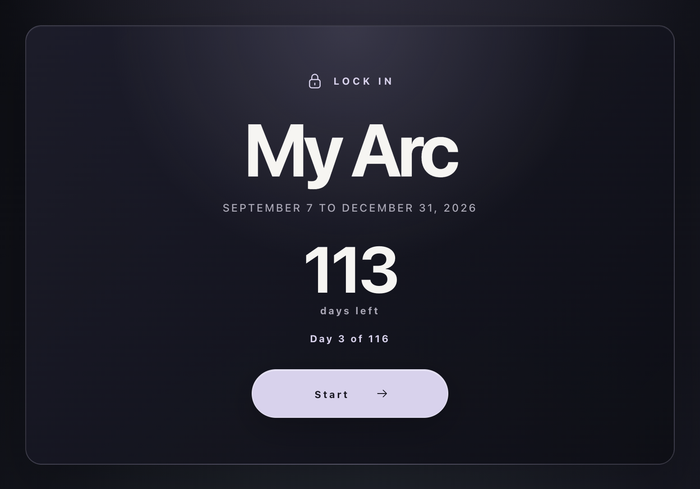
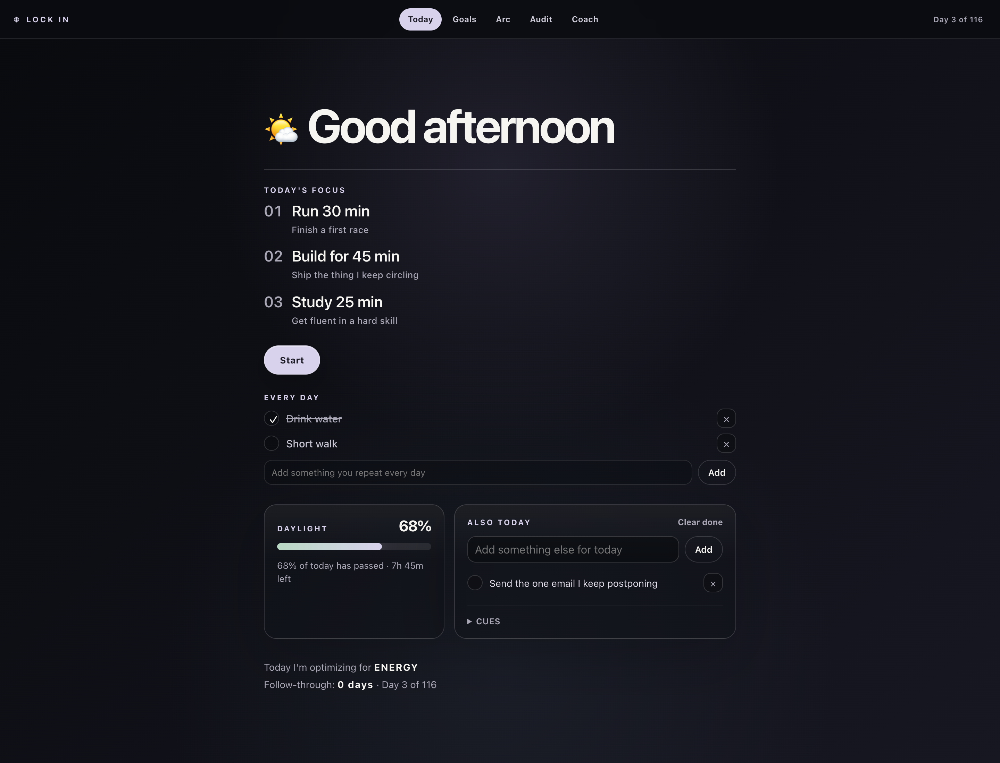
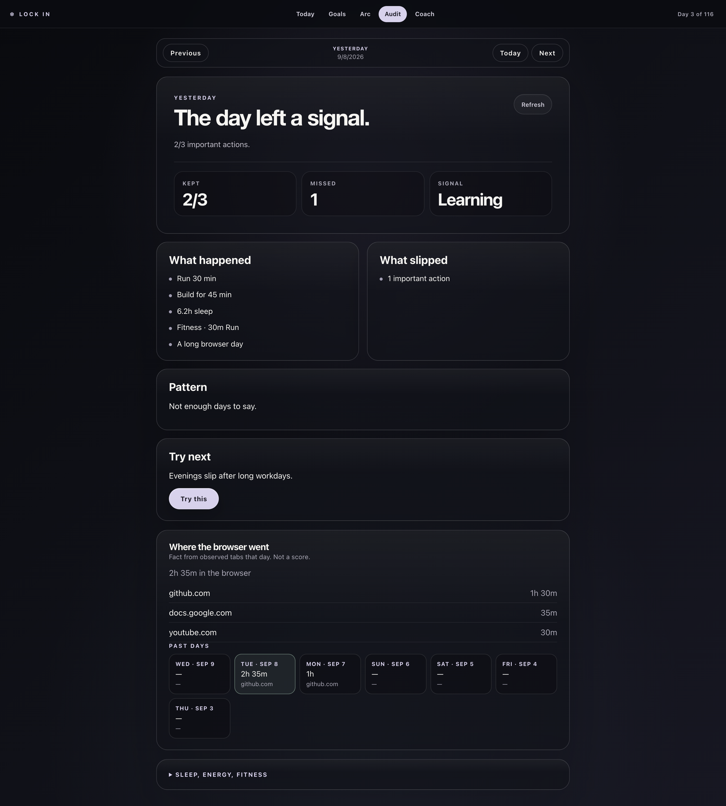

# Screens

Same fake day as the README. Open one like a tab.

[First open](#first-open) · [Today](#today) · [Audit](#audit)

Goals and Arc don't have shots in this set. What they do: [loop.md](loop.md). Settings is the gear in the nav: reset the arc from today, with a second confirm in the app.

<strong>First open</strong>

Dated window. Then you start.

The new-tab card before you've started. Default arc is 116 days, Sep 7 to Dec 31. Copy `src/config/personal.example.js` to `personal.js` if you want different dates or a name. The gear can restart the count from today through that end.

<strong>Today</strong>

A few actions. Repeats stay quiet.

Primary screen. About three things that matter, quieter every-day repeats, a couple of extra bits, cues while Chrome is open. Start runs one action at a time. Not a metrics dashboard.

<strong>Audit</strong>

What happened. Including where the browser went.

Kept vs slipped, a pattern if there are enough days, sleep/energy/fitness check-ins, observed browser time for that day and a few before. After three misses of the same behavior it asks if the plan was unrealistic. **Try this** rewrites tomorrow's plan locally. Experiment results land here too (there's no Experiments tab yet).

